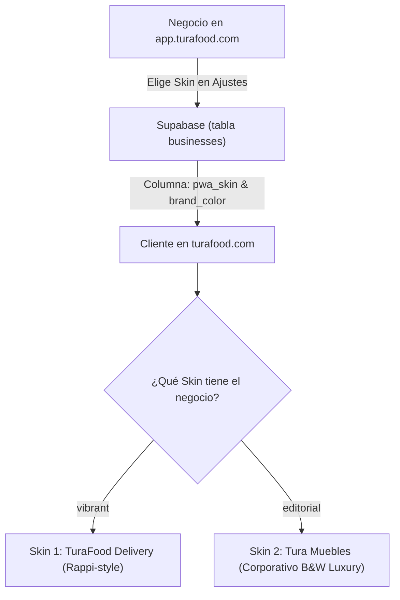

# Guía de Referencia e Integración: Tura Sofa / Tura Muebles → TuraFood

> **Ubicación de la copia en el workspace:** [referencia-turamuebles/](file:///c:/Users/sophi/Downloads/Turafood/referencia-turamuebles)  
> **Fecha de importación:** 9 de octubre de 2026  
> **Propósito:** Transferir la identidad corporativa, sistema de diseño minimalista, tipografía editorial y componentes de alta gama de **Tura Muebles** a **TuraFood** ([turafood.com](https://turafood.com)), permitiendo que cada negocio elija entre un **Skin Delivery Dinámico (Rappi-style)** o un **Skin Corporativo Minimalista (Tura Muebles Black & White)**.

---

## 1. ¿Qué es este proyecto y qué contiene la copia?

La carpeta [referencia-turamuebles/](file:///c:/Users/sophi/Downloads/Turafood/referencia-turamuebles) es una copia íntegra del proyecto de comercio electrónico PWA desarrollado para **Tura Muebles / Tura Sofa**, una plataforma de venta de muebles modulares (Maderkit y RTA) exclusiva para Buenaventura y alrededores.

### Estructura de la copia:
* **[turamuebles/](file:///c:/Users/sophi/Downloads/Turafood/referencia-turamuebles/turamuebles):** El código fuente completo (React 18 + Vite + TypeScript + Zustand + Tailwind/Vanilla CSS + Supabase Edge Functions + PWA Service Worker).
* **[PWA - Screenshots y Handoff - 05-10-2026/](file:///c:/Users/sophi/Downloads/Turafood/referencia-turamuebles/PWA%20-%20Screenshots%20y%20Handoff%20-%2005-10-2026):** Prototipos visuales en HTML/CSS plano y capturas de pantalla que sirven como la **fuente de verdad del diseño original**.
* **[maderkit_buenaventura/](file:///c:/Users/sophi/Downloads/Turafood/referencia-turamuebles/maderkit_buenaventura) y [rta_muebles/](file:///c:/Users/sophi/Downloads/Turafood/referencia-turamuebles/rta_muebles):** Datos y catálogos de proveedores originales con estructura de taxonomías, fotos y metadatos.
* **[HANDOFF.md](file:///c:/Users/sophi/Downloads/Turafood/referencia-turamuebles/turamuebles/HANDOFF.md):** Manual técnico detallado de arquitectura, base de datos y despliegue en Cloudflare Pages.

---

## 2. Análisis de Identidad Corporativa y UI/UX de Tura Muebles

Tura Muebles destaca por un enfoque visual **editorial, sobrio y de lujo accesible**, en contraposición al estilo saturado y estridente de las apps tradicionales de comida rápida.

### A. Paleta Cromática (Black & White Luxury)
| Token | Modo Claro | Modo Oscuro (`.is-dark`) | Uso |
| :--- | :--- | :--- | :--- |
| `--bg` | `#F5F5F5` (Gris galería) | `#0C0C0C` (Negro puro mate) | Fondo general de la aplicación |
| `--surface` | `#FFFFFF` (Blanco puro) | `#171717` (Antracita profundo) | Tarjetas, modales y barras de navegación |
| `--ink` | `#111111` (Negro carbón) | `#F4F4F4` (Blanco marfil) | Textos principales, precios y botones primarios |
| `--ink2` | `#383838` | `#D2D2D2` | Subtítulos y descripciones |
| `--muted` | `#6A6A6A` | `#9C9C9C` | Metadatos (distancia, tiempos, calorías) |
| `--line` | `#E3E3E3` | `#272727` | Separadores y bordes sutiles |
| `--e0` / `--e1` | `0 0 0 1px rgba(17,17,17,.055)` | `0 0 0 1px rgba(255,255,255,.07)` | **Hairline borders:** bordes ultra finos que dan acabado de precisión |

### B. Sistema Tipográfico Dual (Geométrico + Editorial)
1. **Titulares e Impacto:** `Bricolage Grotesque` (pesos 600–700). Da modernidad, fuerza y carácter geométrico a números, precios y nombres de productos.
2. **Palabra de Acento Editorial:** `Instrument Serif` en cursiva/itálica (`.ac` class). Se utiliza para destacar **una sola palabra** en titulares principales (ej: *"Sabor artesanal"*, *"Cocina de autor"*, *"Experiencia gourmet"*). Aporta una estética similar a revistas internacionales como *Monocle*, *Architectural Digest* o *Kinfolk*.
3. **Cuerpo e Interfaz:** `Plus Jakarta Sans` o `Hanken Grotesk` (pesos 400 y 600) a 15px con interlineado 1.5, garantizando lectura fluida en móviles.

### C. Patrones de Interacción (Micro-UX)
* **Feedback Háptico Visual:** Efecto de onda radial (`radial-gradient`) en el estado `:active` de botones y tarjetas para una sensación física al toque en pantallas móviles.
* **Curvas de Animación:** `--ease: cubic-bezier(.2,0,0,1)` para transiciones elegantes, sin rebotes exagerados.
* **Badges y Etiquetas:** Pastillas minimalistas en fondo neutro con texto en contraste, evitando degradados llamativos.
* **Navegación Flotante:** Una barra de pestañas compacta, ligeramente suspendida con sombra `--e2` y soporte para `safe-area-inset-bottom`.

---

## 3. Estrategia de Implementación: Sistema Dual-Skin en TuraFood

El objetivo solicitado es que cada negocio o restaurante pueda **definir su propio estilo de presentación en la PWA de clientes ([turafood.com](https://turafood.com))** mediante una configuración en su panel de administración en [app.turafood.com](https://app.turafood.com).



### Comparativa de los 2 Skins:

| Característica | Skin 1: "TuraFood Vibrante" (Actual) | Skin 2: "Tura Muebles Editorial" (Nuevo) |
| :--- | :--- | :--- |
| **Público Objetivo** | Hamburgueserías, pizzerías, comidas rápidas, heladerías, panaderías | Restaurantes de autor, marisquerías gourmet, cafés de especialidad, boutiques gastronómicas |
| **Paleta Principal** | Naranja `#FF441F`, verde menta, amarillos cálidos, degradados vivos | Monocromático: Negro carbón `#111111`, blanco `#FFFFFF`, grises galería |
| **Tipografía** | `Bricolage Grotesque` + `Plus Jakarta Sans` | `Bricolage Grotesque` + `Instrument Serif` (itálica acento) + `Plus Jakarta Sans` |
| **Tarjetas de Plato** | Borde redondeado generoso (20px), sombras difusas, insignias de descuento de color naranja | Bordes sobrios (12-14px), micro-línea milimétrica (hairline `1px`), fotografía en formato cuadrado/editorial |
| **Botón de Añadir** | Círculo grande naranja brillante con signo `+` flotante | Botón de pastilla rectangular sobrio en negro o blanco con micro-interacción |
| **Cabecera de Tienda** | Banners promocionales coloridos con degradados | Fotografía de portada limpia, tipografía sobria con acento editorial y detalles de ubicación |

---

## 4. Hoja de Ruta Técnica de Integración

### Fase 1: Base de Datos & Configuración (Supabase)
1. Agregar campos a la tabla `businesses`:
   ```sql
   ALTER TABLE businesses 
   ADD COLUMN IF NOT EXISTS pwa_skin TEXT DEFAULT 'vibrant' CHECK (pwa_skin IN ('vibrant', 'editorial')),
   ADD COLUMN IF NOT EXISTS brand_color TEXT DEFAULT '#111111';
   ```

### Fase 2: Panel de Negocios ([app.turafood.com](https://app.turafood.com))
1. En la sección de configuración del negocio (en una nueva tarjeta o vista de personalización), agregar un selector interactivo:
   * **Vista previa en tiempo real** de ambos skins:
     * Card A: *Estilo Delivery Tradicional (Vibrante y Colorido)*
     * Card B: *Estilo Corporativo / Minimalista (Inspirado en Tura Muebles)*
   * Selector opcional de color de acento de la marca.
   * Guardado directo en Supabase mediante `updateBusiness()`.

### Fase 3: Motor de Skins en la PWA de Clientes ([turafood.com](https://turafood.com))
1. Cargar la fuente Google Font `Instrument Serif` en `layout.js` de `turafood-cliente`.
2. Crear el archivo `editorial-theme.css` con todos los tokens de Tura Muebles adaptados para alimentos.
3. En la página del restaurante (`/store/[id]`), aplicar dinámicamente el atributo:
   ```jsx
   <div className={`store-shell ${store?.pwa_skin === 'editorial' ? 'skin-editorial' : 'skin-vibrant'}`}>
   ```
4. Adaptar los componentes de ficha de producto, lista de categorías, cabecera de tienda y barra de carrito para que respeten las variables del skin seleccionado.

---

## 5. Resumen de Archivos Clave en la Referencia

* **Tokens de diseño originales:** [`referencia-turamuebles/turamuebles/src/styles/tokens.css`](file:///c:/Users/sophi/Downloads/Turafood/referencia-turamuebles/turamuebles/src/styles/tokens.css)
* **Estilos base y ripple:** [`referencia-turamuebles/turamuebles/src/styles/base.css`](file:///c:/Users/sophi/Downloads/Turafood/referencia-turamuebles/turamuebles/src/styles/base.css)
* **Tarjetas y layouts de producto:** [`referencia-turamuebles/turamuebles/src/styles/product.css`](file:///c:/Users/sophi/Downloads/Turafood/referencia-turamuebles/turamuebles/src/styles/product.css)
* **Plantilla HTML original de diseño:** [`referencia-turamuebles/PWA - Screenshots y Handoff - 05-10-2026/referencia/plantilla.html`](file:///c:/Users/sophi/Downloads/Turafood/referencia-turamuebles/PWA%20-%20Screenshots%20y%20Handoff%20-%2005-10-2026/referencia/plantilla.html)
